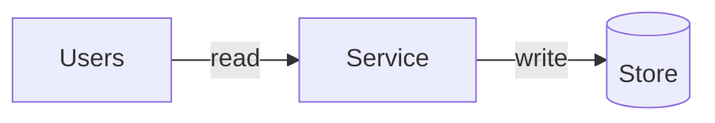

# <Build title> — <one-line what & why>

> Study note from a build-to-learn lab. Mermaid + terminology + the code that matters + how to run it.
> ここに書くこと: 何を作ったか、なぜ作ったかを 1〜2 行で。例: 「トークンバケットで API のレート制限を最小実装して、429 と補充の挙動を確かめた」。

- **Stack:** `<language / framework>` ・ **Lab:** `coach/labs/<NN>-<slug>/` ・ **Runs with:** `<command>`
- **Teaches:** `<concept 1>`, `<concept 2>` ・ **Related concepts:** [caching](../concepts/caching.md), …

> リンク補足: 概念リンクは卒業後の `coach/build-notes/<slug>.md` 起点（`../concepts/…`）。ラボ内の
> `coach/labs/<NN>-<slug>/note.md` では 1 段深いので `../../concepts/…` になる。

## 1. 最小スコープ (minimal scope)

- **やること (in scope):** …
- **やらないこと (out of scope):** …
- **完成の定義 (done when):** 「… が動いて … が見える」。

> ここに書くこと: 実際に動かす 1〜3 個の挙動だけ。増やしたくなったら「やらないこと」に逃がす。

## 2. アーキテクチャ (architecture)



- **向いている (when it fits):** …
- **実装する箱 (implemented here):** …（図のどの箱を本当にコードにしたか）
- **注意点 (caveats):** …

> ここに書くこと: 箱＝役割、矢印＝データの流れ、ラベル＝read / write / async。最小実装で本当に作った箱を明記する。

## 3. マイルストーンと学び (milestones & learning)

各マイルストーンごとに、用語 → コード抜粋 → なぜ大事か、を残す。

### M1. <milestone title>

- **用語 (terms):** `用語（English）` — 短い説明。
- **関連概念 (related):** [`<concept>`](../concepts/<file>.md)

```text
// 必要な部分だけ抜粋（the necessary code, not the whole file）
```

- **なぜ大事か (why it matters):** …
- **落とし穴 (gotcha):** …

> ここに書くこと: ファイル全部ではなく「これが肝」という数行。読み返して思い出せる粒度に。

### M2. <milestone title>

（同じ形式で増やしていく）

## 4. 動かし方 (how to run)

```bash
# setup
<install / venv>
# run
<command>
# expect
<expected output>
```

> ここに書くこと: これを見れば後日ゼロから再現できる手順。ポートや前提もメモする。

## 5. 学んだこと・次の一手 (learned & next)

- **学んだこと (learned):** …
- **トレードオフ (trade-offs):** …
- **次にやるなら (next):** …（この最小実装から何を足すと本番に近づくか）

> ここに書くこと: 設計面での気づき。coach の Interview / Drill に戻すネタもここに。
