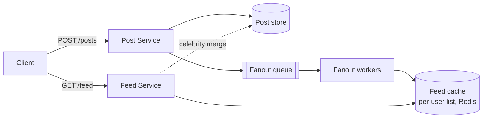
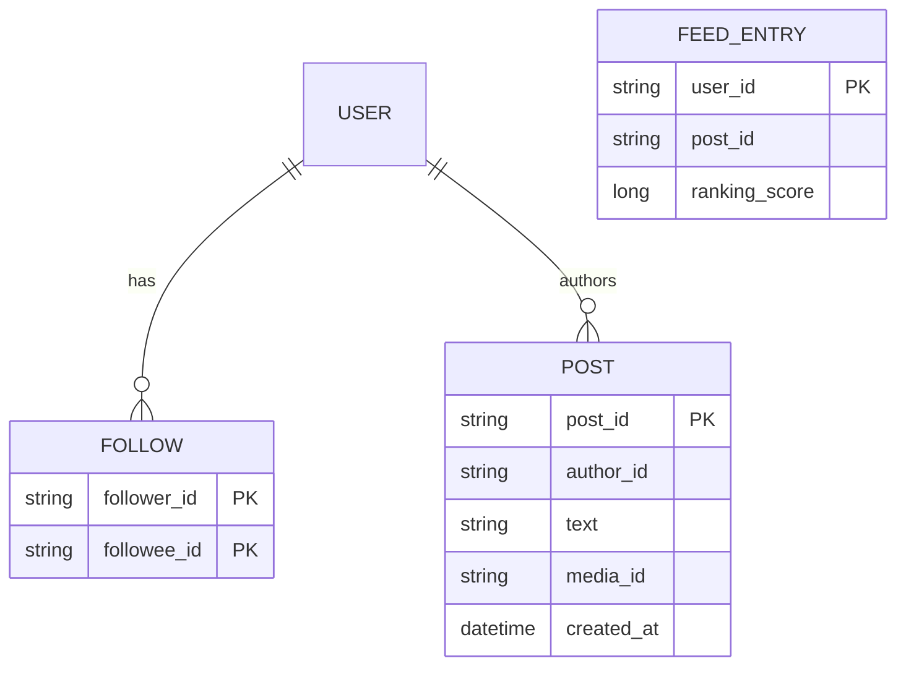

# News Feed — Reference Design

> **Hidden until Explain / Wrap-up.**

## 1. Requirements (recap)

Read-heavy, low-latency feed reads, eventual consistency OK, 100M+ users with celebrity skew. The
central tension is **fan-out strategy**.

## 2. Estimation

- 100M DAU × ~10 feed loads/day = 1B reads/day ≈ **~12,000 reads/s** avg, ~35,000/s peak.
- Posts: 100M × ~2/day = 200M/day ≈ **~2,300 writes/s** avg.
- Fan-out cost: avg 200 followers → a normal post writes to ~200 feeds; a celebrity post (10M
  followers) writes to 10M feeds → the core scaling problem.

## 3. API

```
POST /api/v1/posts
  Authorization: Bearer <token>
  { "text": "...", "mediaId": "..." }
  -> 201 { postId, createdAt }

GET /api/v1/feed?limit=20&cursor=<opaque>
  -> 200 {
       items: [ { postId, authorId, text, mediaUrl, createdAt, score } ],
       nextCursor: "<opaque>"
     }
```

Use **cursor-based pagination** (not offset) — stable under inserts and efficient at scale.

## 4. High-level design



## 5. Fan-out strategies (deep dive — the crux)

- **Fan-out on write (push):** when a user posts, push the post id into each follower's
  precomputed feed list. **Fast reads** (just read your list). Expensive writes; terrible for
  celebrities (10M writes per post).
- **Fan-out on read (pull):** store posts by author; at read time, gather recent posts from all
  followees and merge. **Cheap writes**, heavy reads; bad for users following many people.
- **Hybrid (recommended):** push for normal users; for **celebrities**, don't fan out — followers
  **pull** the celebrity's recent posts at read time and **merge** with their pushed feed. Best of
  both; this is the key insight.

## 6. Data model



- Posts in a wide-column / KV store keyed by `author_id` (recent posts per author).
- Precomputed feed = a capped per-user list in **Redis** (e.g. latest ~1,000 ids).

## 7. Ranking

Chronological is the baseline. For a ranked feed, compute a score (recency, affinity,
engagement) at write/fan-out time or at read time; keep it pluggable. Keep ML internals out of scope.

## 8. Scaling & bottlenecks

- **Feed cache (Redis)** absorbs the read load; shard by `user_id`.
- **Fan-out workers** scale horizontally off the queue; smooth spikes via the queue.
- **Celebrity fan-out** avoided via the hybrid pull-merge.
- **Media** in object storage (S3) + CDN; feed stores references only.

## 9. Reliability & trade-offs

- Eventual consistency: a post may take seconds to appear — acceptable.
- Feed cache miss → rebuild from posts store (slower path).
- Push vs pull vs hybrid is the central trade-off; justify from follower distribution.

## 10. With more time

Ranking service, dedup/seen-state, real-time updates (websockets), abuse filtering, cold-start
for new users, feed backfill jobs.
