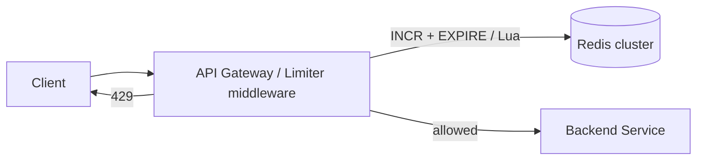
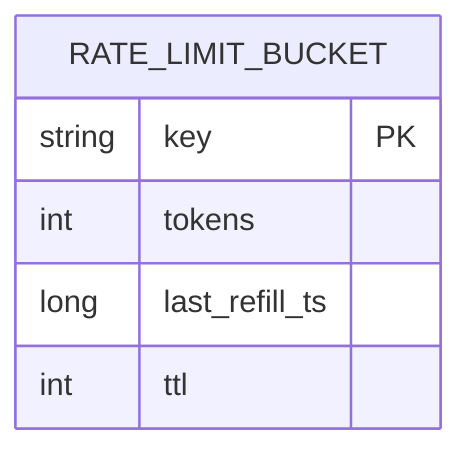

# Distributed Rate Limiter — Reference Design

> **Hidden until Explain / Wrap-up.**

## 1. Requirements (recap)

Per-key limits enforced across many API servers, < ~5 ms overhead, HA, high QPS, minor inaccuracy
OK. See `../../concepts/rate-limiting.md` for algorithm background.

## 2. Estimation

- 10,000 req/s aggregate → the limiter is on **every** request → it must be a memory-speed op.
- 1M keys × small counter (~tens of bytes) → easily fits in Redis memory (~tens of MB).
- Hot path budget: one in-memory round trip (~0.5 ms intra-DC) + atomic op.

## 3. API / integration

Rate limiting is **middleware** in the API gateway / service, not a user-facing API. Behavior:

```
Any request -> limiter.check(key, route)
  allowed:   pass through
             Headers: X-RateLimit-Limit: 100
                      X-RateLimit-Remaining: 87
                      X-RateLimit-Reset: 1718700000
  throttled: 429 Too Many Requests
             Headers: Retry-After: 23
                      X-RateLimit-Remaining: 0
```

## 4. High-level design



## 5. Algorithm choice

- **Token bucket** (recommended for APIs): refill at rate `r`, capacity `b` (allows controlled
  bursts). Store `{tokens, last_refill_ts}` per key; on request, refill by elapsed time, spend 1.
- **Sliding window counter** when smooth, boundary-safe accuracy matters with low memory.
- Avoid plain fixed window (2× boundary burst) unless simplicity is the priority.

## 6. Data model (per key, in Redis)



Use a **Lua script** (or `INCR`+`EXPIRE`) so the read-modify-write is **atomic** — avoids races
between servers. TTL lets idle keys expire and frees memory.

## 7. Distributed correctness (deep dive)

- Single shared **Redis** gives one source of truth; atomic Lua = no double counting.
- Scale Redis by **sharding on key** (each key's counter lives on one shard → no cross-shard
  coordination).
- **Latency optimization:** local token bucket per node with periodic sync, accepting slight
  over-limit — trades accuracy for fewer Redis hops. State the trade-off.
- **HA / failure mode:** if Redis is unreachable, **fail-open** (allow) to protect availability,
  or **fail-closed** for sensitive endpoints (login). Make it a per-route policy.

## 8. Scaling & bottlenecks

- Redis is the hot path → cluster it, shard by key, replicas for HA.
- Watch a single very hot key (one abusive client) → that shard gets hammered; that's acceptable
  since it's bounded by the limit, but isolate noisy tenants if needed.

## 9. Reliability & trade-offs

- Accuracy vs latency (central vs local counters).
- Availability vs strictness (fail-open vs fail-closed).
- Memory vs accuracy (sliding-window log vs counter).

## 10. With more time

Tiered limits, per-route configs, dynamic limit updates, analytics on throttle events, global
multi-region limits (harder — usually approximate per region).
