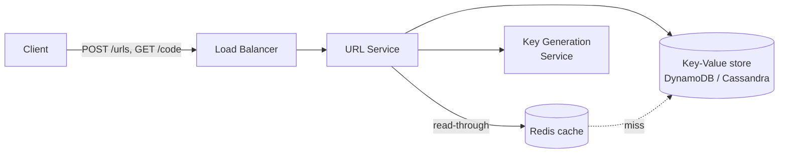
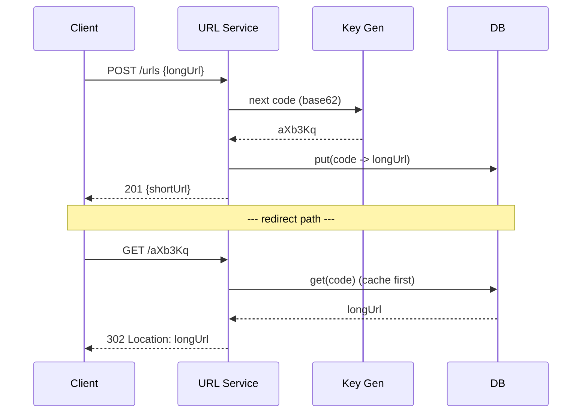
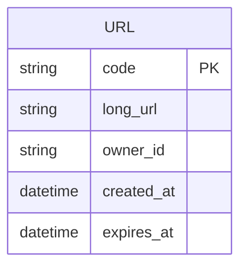

# URL Shortener — Reference Design

> **Hidden until Explain / Wrap-up.** Don't leak this into interview prompts.

## 1. Requirements (recap)

Read-heavy (≈100:1), HA + low-latency redirects, short unguessable base62 codes, optional custom
alias + expiry.

## 2. Estimation

- Writes: 100M/month ≈ **~40 writes/s** avg, ~120/s peak.
- Reads: 100× → **~4,000 reads/s** avg, ~12,000/s peak.
- Storage: 100M/mo × 12 × 5y = 6B URLs. ~500 bytes/record → **~3 TB** (+ indexes).
- Keyspace: base62, length 7 → 62^7 ≈ 3.5 × 10^12 → ample for 6B records.

## 3. API

```
POST /api/v1/urls
Headers:
  Content-Type: application/json
  Authorization: Bearer <token>
  Idempotency-Key: <uuid>            # safe retries, no duplicate codes
Request:  { "longUrl": "https://…", "customAlias": "promo", "expiresAt": "2027-01-01" }
Response 201 Created:
  Location: https://sds.io/aXb3Kq
  { "shortUrl": "https://sds.io/aXb3Kq", "code": "aXb3Kq", "expiresAt": "…" }

GET /{code}
Response 302 Found:
  Location: https://original.example.com/very/long/path
  Cache-Control: private, max-age=86400
Response 404 if unknown/expired (410 Gone if you track expiry explicitly).
```

Notes: redirect uses **302** (or 301 if permanent *and* you accept aggressive browser caching).
`Idempotency-Key` prevents duplicate codes on client retry. Add `X-RateLimit-*` headers on writes.

## 4. High-level design



## 5. Request flows



## 6. Data model



- **Store:** key-value / wide-column (DynamoDB, Cassandra). Partition key = `code` → O(1)
  lookup, scales horizontally, no joins. Redirects are point lookups → perfect for KV.

## 7. Key generation (deep dive)

Three approaches:

1. **Hash (MD5/SHA) + truncate** to 7 base62 chars — simple, but collisions need check-and-retry,
   and the same URL maps to the same code unless salted.
2. **Counter + base62 encode** — a global incrementing ID encoded to base62. Unique by
   construction, no collisions. Risk: sequential / guessable → mitigate with an offset or a
   Hashids-style permutation. Distribute the counter with a **Key Generation Service** handing out
   ranges (e.g. ZooKeeper / DB ticket ranges) so each app server allocates locally.
3. **Pre-generated keys (KGS)** — a service pre-computes unused keys into a table and hands them
   out in batches; mark keys used. Fast, no runtime collision checks. Interview-favored.

**Recommended:** pre-generated KGS with batched allocation + replication.

## 8. Scaling & bottlenecks

- **Reads dominate** → put a **cache (Redis)** in front; 80/20, hot links served from memory.
- **CDN / edge** can cache 301s globally for ultra-low latency (trade-off: harder to expire).
- **DB**: KV store shards by `code` automatically; add read replicas if needed.
- **Stateless services** behind the LB → scale horizontally.
- **Watch:** cache stampede on a viral link → request coalescing / TTL jitter.

## 9. Reliability & trade-offs

- No SPOF: replicate cache, DB, KGS; multi-AZ.
- **Consistency:** uniqueness is strong on the write; redirects tolerate eventual (a just-created
  link readable within a second or two is fine).
- Failure: cache down → fall through to DB (degraded latency, still correct).
- Expiry: lazy delete on read + background sweeper.

## 10. With more time

Analytics (async via queue → warehouse), abuse detection, custom domains, 410 Gone for expired
links, per-user quotas.
