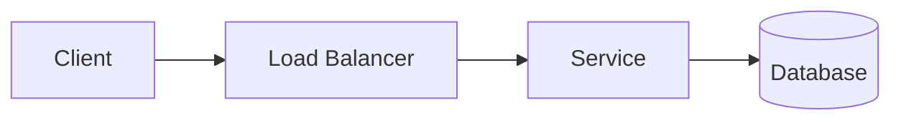
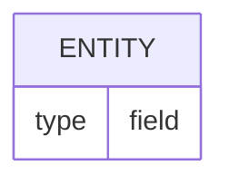

# Design — {{problem}} — v{{n}} ({{date}})

## 1. Requirements

- **Functional:**
- **Non-functional:**
- **Out of scope:**

## 2. Estimation

- **Assumptions:**
- **QPS (avg / peak):**
- **Storage:**
- **Bandwidth:**

## 3. API

```text
METHOD /path
Headers:
Request:
Response (status):
```

_Or reference your own `openapi.yaml` (edited in Swagger Editor or the `42Crunch.vscode-openapi`
extension) — the coach grades the API dimension straight from the spec._

## 4. 高レベルアーキテクチャ (High-level architecture)

_Preferred for Phase 4: edit a draw.io source file such as `design/high-level-v{{n}}.drawio`, usually
copied from `coach/templates/high-level-architecture.drawio`. If you prefer text, use Mermaid below._

- **何を描くか:** 箱には主要コンポーネント（Component）を書きます。例: Client、API Gateway、Service、Cache、Database、Queue。
- **矢印の意味:** 矢印にはデータフロー（Data flow）を書きます。読み取り経路（read path）、書き込み経路（write path）、非同期経路（async path）が区別できるようにラベルを付けます。
- **足し引き:** 今回の設計に不要な箱は消し、必要な保存先・キャッシュ・キューだけを残します。

- **Diagram source:** draw.io = `design/high-level-v{{n}}.drawio` / Mermaid = paste below



## 5. Data model

_Use Mermaid `erDiagram` or a draw.io data model canvas._



## 6. スケーリングとボトルネック (Scaling & bottlenecks)

_まず「どこが最初に詰まるか」を 1 つ選び、その次に各レイヤーをどう伸ばすかを書きます。今回の設計にない項目は削るか、`今回は対象外` と書いてください。_

- **Main bottleneck（主なボトルネック）**
  - ここで書くこと: 最初に限界が来そうな場所を 1 つ選びます。CPU、DB 書き込み、Redis の特定 shard、外部 API など。
  - 例: `ピーク時は Redis の特定キーにアクセスが集中するため、Redis shard が最初のボトルネックになる。`
  - 回答:

- **API Gateway / middleware scaling（API ゲートウェイ / ミドルウェアのスケール）**
  - ここで書くこと: API Gateway や middleware をステートレスにして水平スケールできるか、どこで認証・レート制限・ログを処理するかを書きます。
  - 例: `Gateway はステートレスにして LB 配下で水平スケールし、重い判定は Redis / policy cache に逃がす。`
  - 回答:

- **Redis scaling（Redis のスケール）**
  - ここで書くこと: Redis を使う場合、sharding / replica / memory / TTL / Lua script や pipeline の扱いを書きます。
  - 例: `user_id で shard し、読み取りは replica、カウンタ更新は primary で atomic に処理する。`
  - 回答:

- **Hot key / abusive user handling（ホットキー / 不正利用ユーザー対応）**
  - ここで書くこと: 特定ユーザー・特定キーへの集中、攻撃的なアクセス、テナントごとの隔離や遮断を書きます。
  - 例: `単一ユーザーの過剰アクセスは per-user limit と blocklist で抑え、hot key は shard suffix で分散する。`
  - 回答:

- **Policy/config cache scaling（ポリシー / 設定キャッシュのスケール）**
  - ここで書くこと: レート制限ポリシーや設定をどこにキャッシュし、更新・失効・反映遅延をどう扱うかを書きます。
  - 例: `policy は各 Gateway の local cache に持ち、version 付きで 30 秒ごとに更新する。緊急変更は push invalidation する。`
  - 回答:

- **What I would monitor（監視するもの）**
  - ここで書くこと: 詰まりを検知する指標を書きます。latency、error rate、Redis CPU/memory/ops、hot key、rate-limited requests、queue lag など。
  - 例: `p95/p99 latency、429 rate、Redis ops/sec、memory usage、hot key top N、Gateway CPU、policy cache hit rate。`
  - 回答:

## 7. Reliability & trade-offs

-

## 8. Open questions / with more time

-
