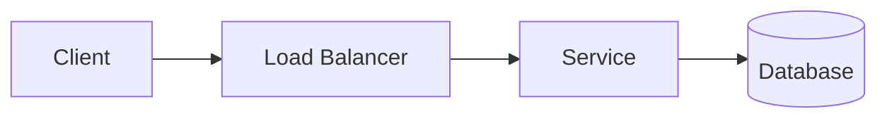
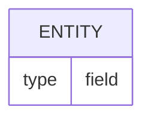

# Design — {{problem}} — v{{n}} ({{date}})

## 1. Requirements

- **Functional:**
- **Non-functional:**
- **Out of scope:**

## 2. Estimation

- **Assumptions:**
- **QPS (avg / peak):**
- **Storage:**
- **Bandwidth:**

## 3. API

```text
METHOD /path
Headers:
Request:
Response (status):
```

_Or reference your own `openapi.yaml` (edited in Swagger Editor or the `42Crunch.vscode-openapi`
extension) — the coach grades the API dimension straight from the spec._

## 4. High-level design



## 5. Data model



## 6. Scaling & bottlenecks

-

## 7. Reliability & trade-offs

-

## 8. Open questions / with more time

-
