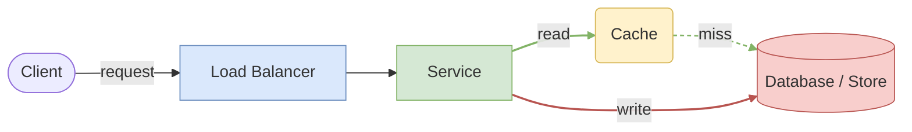
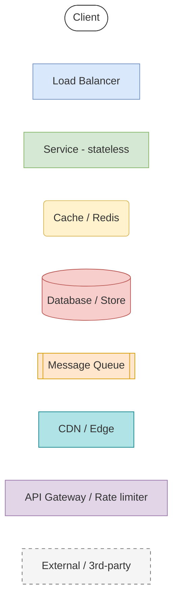
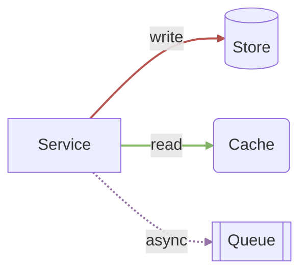
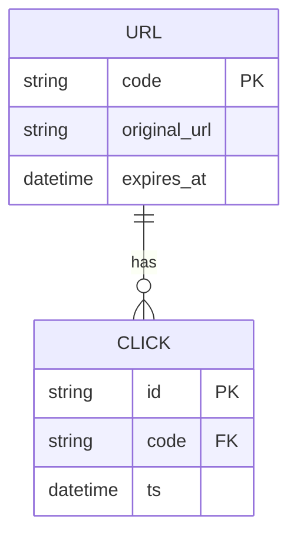

# Mermaid Diagram Palette

Copy-paste building blocks for system-design diagrams, color-matched to
[`diagram-palette.drawio`](./diagram-palette.drawio). Same conventions: **components colored by
type, edges coded by direction** — write = red, read = green, async = dashed purple, optional =
dotted gray.

> Mermaid renders in VS Code's Markdown preview and on GitHub — no extension needed. You edit the
> text; the coach reads and grades it directly.

## 1. Copy-paste skeleton (start here)

Copy the whole block, delete what you don't need, and rewire the arrows.



## 2. Component palette (copy a styled node)

Each node carries its type's color via an inline `:::class`. Copy any node line plus its matching
`classDef`.



| Type | Node shape | `classDef` fill / stroke |
| --- | --- | --- |
| Client | `([Client])` stadium | `#ffffff` / `#333333` |
| Load Balancer / network | `[Load Balancer]` rect | `#dae8fc` / `#6c8ebf` (blue) |
| Service (stateless) | `[Service]` rect | `#d5e8d4` / `#82b366` (green) |
| Cache | `(Cache)` rounded | `#fff2cc` / `#d6b656` (yellow) |
| Database / Store | `[(Store)]` cylinder | `#f8cecc` / `#b85450` (red) |
| Message Queue | `[[Queue]]` subroutine | `#ffe6cc` / `#d79b00` (orange) |
| CDN / Edge | `[CDN]` rect | `#b0e3e6` / `#0e8088` (teal) |
| Gateway / Rate limiter | `[Gateway]` rect | `#e1d5e7` / `#9673a6` (purple) |
| External / 3rd-party | `[External]` rect | `#f5f5f5` / `#666666` dashed (gray) |

## 3. Edge conventions (direction = line + color)

```text
write            A -->|write| B        solid  red     stroke:#b85450
read             A -->|read| B         solid  green   stroke:#82b366
async / event    A -.->|async| B       dashed purple  stroke:#9673a6
optional / back  A -.->|optional| B    dotted gray    stroke:#999999
```

`linkStyle` is **index-based** — edges are numbered 0, 1, 2… in source order. Add the styles after
the edges:



## 4. Data model (erDiagram) starter


